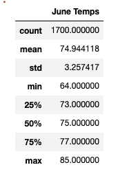
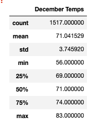
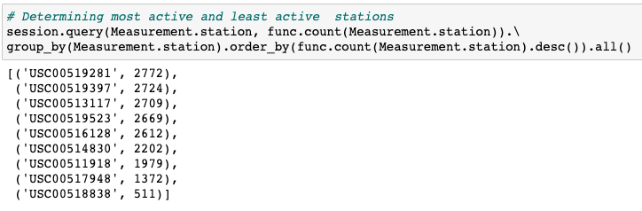
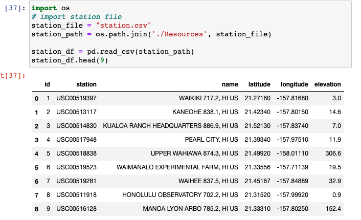
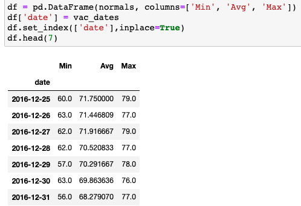
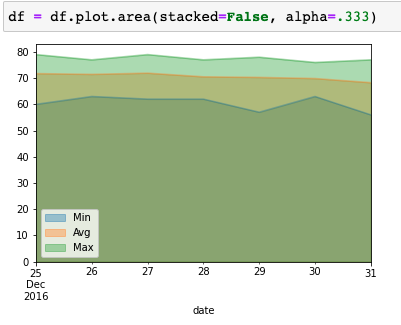
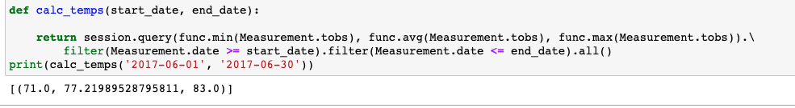

# SurfsUp

## Overview of the Analysis

The purpose of this assignment was to provide insight into weather patterns in Hawaii, before opening a hypothetical surf shop in Oahu. The main focus of the analysis was on temperature data for the months of June and December, in order to determine if the surf shop would be sustainable year-round.

The assignment consists of the following two technical analysis: 

- Determine the summary statistics for June
- Determine the summary statistics for December

Using Python, Pandas functions and methods, and SQLAlchemy, the date column of the Measurements table in a sqlite database was filtered to retrieve all temperatures for the month of June and December. The list of temperatures was then converted to a DataFrame. Lastly, summary statistics are generated for the DataFrame.

## Resources

- SQLAlchemy 
- Flask 
- Jupyter Notebook and Pandas
- hawaii.sqlite file
- VS Code

## Results

Based on the exploratory analysis, the results showed that the average temperature for the months of June and December during the years from the data collected was 75˚ and 71˚, respectively. The lowest temperature on record for June and December was 64˚ and 56˚, and max highs were 85˚ and 83˚, respectively. The standard deviation for June was 3.25 and 3.75 in December, indicating only a 0.5 difference, which shows no major variation in the averages between the two. 

The SQLite database contained information on collection stations that were used to collect the precipitation data. In order to determine the reliability of the data, a query using the func.count and referencing Station.station was executed to show the number of stations and its recordings. The counts indicated that the collection station in Waihee, HI was the most active (2772 recordings) and Upper Wahiawa, HI was the least active (511 recordings). It is important to note that Upper Wahiawa also has the highest elevation (306.6) out of all nine stations.

## Fig. 1

### Stats Summary June

## Fig. 2

### Stats Summary Dec

## Fig. 3

### Active Stations 

## Fig. 4

### Name and Locations of Stations

## Additional Analysis

Additional queries were performed to gather more weather data for specific dates in the months of December, based on peak tourism season (12-25 to 12-31) in 2016 . The daily normal temperatures recorded from this time frame showed minimum  temperature of 60˚, average 71.75˚, and max 79˚.

An additional query was designed to retrieve the last 12 months of precipitation data from the 12-24-2016 and above mentioned time frame. The results showed higher precipitation levels during the summer months versus December. Lastly, temperatures were calculated from filtered dates for the month of June in 2017. The findings showed a low temperature of 71˚, average 77˚, and high of 83˚.

## Fig. 5

### Temps for Selected Dates

## Fig. 6

### Min Max Avg Temps

## Fig. 7

### Precipitation Query

## Fig. 8

### Temps June 2017

In conclusion, the entire weather exploratory analysis showed that Hawaii is seasonally warm all year round. 

